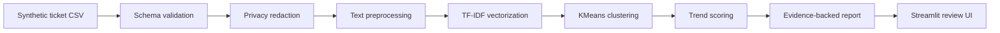

# AI Support Trends Detection

[](https://github.com/Yufereva/ai-support-trends-detection/actions/workflows/tests.yml)

AI-assisted workflow for detecting emerging support trends, recurring customer friction, and product issues from support tickets.

**Project status:** Portfolio MVP

> All sample data in this repository is synthetic. No customer or former employer data is included.

## Business Problem

Support teams often see product friction before other teams do, but the signal is distributed across many individual tickets. Important patterns can remain anecdotal until a support leader manually reviews ticket queues, searches for similar cases, and assembles evidence for Product or Engineering.

This prototype is designed to help Support Operations identify emerging customer friction earlier and produce reviewable, evidence-backed trend summaries.

## What The System Does

- Loads a synthetic support ticket dataset or reviewer-uploaded CSV.
- Validates the required ticket schema.
- Redacts obvious PII-like strings before analysis.
- Combines ticket subject, description, product area, and tags.
- Uses a transparent TF-IDF and clustering baseline to group related tickets.
- Compares current and previous periods to identify growth.
- Ranks detected trends by volume, growth, customer tier, and priority.
- Produces supporting ticket IDs, impact framing, and recommended next action.

## Intended Users

- Support Operations leaders
- Support Managers
- Support Engineering teams
- Product Operations partners
- Product and Engineering leaders reviewing customer friction

## Current Capabilities

- [x] Synthetic support ticket dataset
- [x] Local trend detection pipeline
- [x] Streamlit review interface
- [x] Evidence-backed trend output
- [x] CSV upload with the same schema
- [x] JSON and Markdown export
- [x] Core pytest coverage
- [x] Ruff lint configuration
- [x] GitHub Actions quality checks

## Example Detected Trend

The included synthetic dataset produces a trend similar to:

```text
Trend: CSV exports timing out for large datasets
Classification: Emerging product issue
Evidence: 55 current-period tickets vs 23 prior-period tickets
Customer impact: recurring reporting/export friction, including enterprise-tier tickets
Recommended action: open a Product/Engineering investigation after human review
Suggested priority: P1
Confidence: High
```

These values are generated from synthetic data and should not be interpreted as production measurements.

## How The System Works



## Business Value

The prototype is intended to support:

- earlier visibility into emerging customer friction;
- reduced manual ticket review;
- better evidence quality for Product and Engineering;
- clearer linkage between individual tickets and broader customer-impact patterns;
- human-reviewable recommendations rather than automated operational decisions.

## Intended Success Metrics

For a future pilot, this workflow could be evaluated using:

- time to identify a review-worthy trend;
- trend precision and recall against known escalations;
- reviewer acceptance rate;
- evidence coverage per escalation;
- manual analysis time saved;
- false-positive rate.

## Privacy And Responsible AI

All committed data is synthetic. The MVP does not require API keys or access to customer systems.

The system is designed for human review. It should not automatically declare incidents, create customer-facing messages, or assign engineering priority without a responsible reviewer.

See [Privacy and Responsible AI](docs/privacy-and-responsible-ai.md).

## Quick Start

### Install

```bash
pip install -r requirements.txt
```

### Run

```bash
streamlit run app.py
```

The app loads `data/sample_tickets.csv` by default. You can also upload a CSV with the same schema from the sidebar.

### Test And Lint

```bash
pytest
ruff check .
```

## Input Schema

Required CSV columns:

| Column | Description |
|---|---|
| `ticket_id` | Synthetic or source ticket identifier |
| `created_at` | Ticket creation date |
| `subject` | Ticket subject |
| `description` | Ticket body or summary |
| `product_area` | Product or workflow area |
| `customer_tier` | Customer segment or tier |
| `priority` | Ticket priority |
| `status` | Ticket status |
| `channel` | Support channel |
| `tags` | Pipe-separated tags |

## Repository Structure

```text
app.py                         Streamlit review interface
src/support_trend_detection/   Testable trend detection logic
data/                          Synthetic sample dataset
examples/                      Generated example outputs
docs/                          Architecture, privacy, rollout, evaluation
tests/                         Core pytest suite
.github/                       CI, issue templates, PR template
```

## Documentation

- [Architecture](docs/architecture.md)
- [Product Requirements](docs/product-requirements.md)
- [Privacy and Responsible AI](docs/privacy-and-responsible-ai.md)
- [Evaluation Framework](docs/evaluation-framework.md)
- [Rollout Plan](docs/rollout-plan.md)
- [Limitations](docs/limitations.md)

## Current Limitations

- Synthetic data only.
- Baseline clustering, not production ML.
- No live Zendesk, Jira, Slack, or CRM integrations.
- No multilingual evaluation.
- No production security review.
- No causal inference.
- False positives and false negatives are possible.

## Roadmap

- [x] Synthetic support ticket dataset
- [x] Local trend detection pipeline
- [x] Streamlit review interface
- [x] Evidence-backed trend output
- [x] Core test coverage
- [x] GitHub Actions quality checks
- [ ] LLM-assisted summaries
- [ ] Zendesk ingestion
- [ ] Jira export
- [ ] Slack notifications
- [ ] Scheduled trend monitoring
- [ ] Human approval workflow

## Related Portfolio Projects

This repository is part of a portfolio of AI-assisted workflows designed around real Support Operations and Support Engineering problems.

Additional standalone agent repositories will be linked here as they are released.

## License

MIT License. See [LICENSE](LICENSE).
