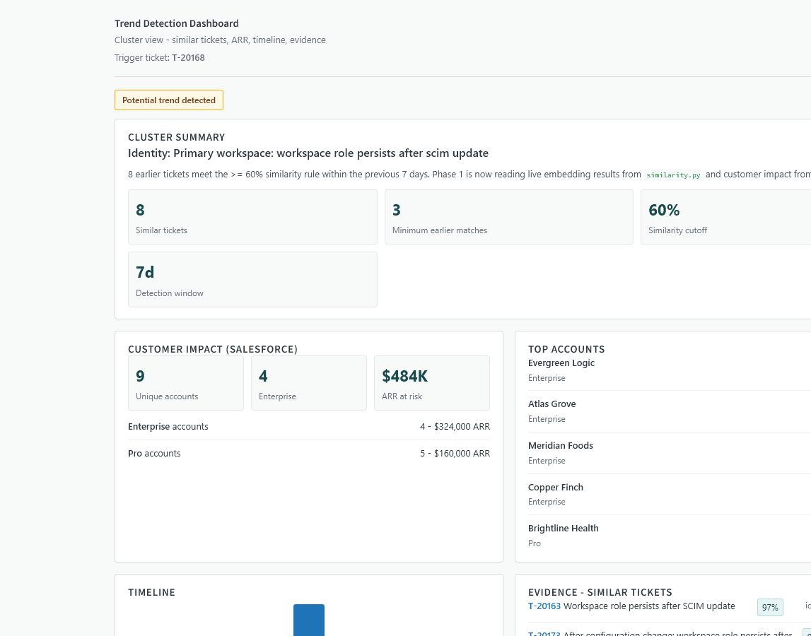
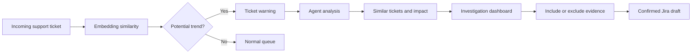

# AI Support Trend Detection

[](https://github.com/Yufereva/ai-support-trends-detection/actions/workflows/tests.yml)

A standalone portfolio application that detects emerging support-ticket trends and turns them into reviewable evidence for Support Operations, Product, and Engineering.

## Why This Matters

Support teams often see product issues before anyone else does, but those signals get buried inside ticket volume. This project shows how AI can help Support Ops detect repeated customer problems earlier, package the evidence, and create a reviewable escalation for Product and Engineering.

**Project status:** Portfolio MVP

> Every ticket, account, person, company, URL, and identifier committed here is synthetic. No customer or employer data is included.

## Screenshot



## Demo

A full walkthrough of the T-20179 SCIM/identity trend, from the ticket flagging a potential trend through evidence review to Jira draft creation (all data synthetic).

[Watch the demo video](assets/demo-video.mp4)

The video uses T-20179. The reproducible README example below uses T-20119.

## Product Workflow


```mermaid
flowchart LR
    A[Incoming support ticket] --> B[Embedding similarity]
    B --> C{Potential trend?}
    C -->|Yes| D[Ticket warning]
    C -->|No| E[Normal queue]
    D --> F[Agent analysis]
    F --> G[Similar tickets and impact]
    G --> H[Investigation dashboard]
    H --> I[Include or exclude evidence]
    I --> J[Confirmed Jira draft]
```

The application checks incoming tickets against the previous seven days of ticket history. A warning appears when at least three same-category tickets meet the 60% semantic-similarity threshold. The reviewer can then inspect scores, customer impact, evidence, and a draft engineering escalation.

## Current Capabilities

- Reproducible dataset of 1,500 synthetic support conversations and accounts.
- Automatic trend checks for incoming tickets through the Streamlit queue and FastAPI webhook.
- Sentence-transformer embeddings using `all-MiniLM-L6-v2`.
- Same-category and time-window safeguards that reduce false positives.
- Similar-ticket evidence with individual similarity scores.
- Synthetic account, tier, and ARR-at-risk impact summaries.
- Investigation dashboard with ticket filters, similarity explanations, and evidence review.
- Per-ticket include/exclude controls with live account and ARR recalculation.
- Ticket-volume and synthetic operational-event timelines for correlation review.
- Explicit trend confirmation that persists the reviewed evidence set and updates the Jira draft.
- One-click local Jira draft creation from Zendesk or the Trend Dashboard.
- Local Jira-style backlog and issue view; no real Atlassian issue is created.
- Zendesk App Framework sidebar demo backed by the local API.
- Regression tests for trend, non-trend, boundary, incoming-warning, and stale-Jira cases.

## Demo Scenario

Fastest way to try it: run the app, open ticket T-20119, and follow the Trend Detection warning into the Jira draft flow.

1. Use one of the suggested demo tickets in the sidebar.
2. The app checks whether similar tickets appeared in the previous seven days.
3. If a potential trend is detected, open the investigation dashboard.
4. Review the matching tickets, include or exclude evidence, and generate a local Jira-style escalation draft.

## Example Escalation Package

This is the kind of package the agent hands to Product and Engineering once a trend is confirmed. It reflects the actual demo dataset — open ticket `T-20119` in the app to reproduce it.

**Pattern**
API key rotation leaves production authentication broken, even though the same request succeeds in test.

**Evidence**
- 17 similar tickets detected (≥60% semantic similarity)
- 18 total linked tickets across 16 unique accounts
- 9 enterprise accounts affected

**Customer impact**
Est. $979K ARR at risk (synthetic Salesforce data).

**Representative examples**
- T-20119: Production blocked: api rotation left production authentication broken.
- T-20114: After configuration change: api rotation left production authentication broken.
- T-20104: API rotation left production authentication broken.

**Suggested next step**
Product and Engineering review.

## Quick Start

Python 3.11 or newer is recommended.

```bash
python -m venv .venv
# Windows: .venv\Scripts\activate
# macOS/Linux: source .venv/bin/activate
pip install -r requirements.txt
python data/synthetic/import_to_app.py apply
streamlit run app.py
```

Open `http://localhost:8501`. The first analysis downloads the free `all-MiniLM-L6-v2` model and creates `data/runtime/embeddings_cache.npz`; generated runtime files are ignored by Git.

Suggested demo tickets are shown in the application sidebar. The complete workflow is:

```text
Incoming ticket -> Potential trend warning -> Analyze -> Similar tickets
-> Investigation Dashboard -> Confirm reviewed cluster -> Jira draft
```

## Local API

Start the API in a second terminal:

```bash
uvicorn api.main:app --reload --port 8000
```

Health check: `GET http://127.0.0.1:8000/health`

Automatic incoming-ticket check:

```http
POST /webhooks/tickets/incoming
Content-Type: application/json

{"ticket_id": "T-20168"}
```

The API also accepts `POST /analyze` with either a known `ticket_id` or free-text `subject` and `body`.

## Tests And Lint

```bash
pytest -q
ruff check .
```

GitHub Actions runs both checks on pushes and pull requests.

## Repository Structure

```text
app.py                    Streamlit helpdesk and review experience
similarity.py             Embeddings, similarity, and trend rules
impact.py                 Synthetic account and ARR impact
trend_view.py             Trend dashboard
trend_review_store.py     Confirmed-review runtime persistence
jira_view.py              Local Jira-style draft and backlog
api/                      FastAPI analysis and incoming webhook
data/synthetic/           Dataset, schema, generators, and evaluation
data/runtime/             Generated local DB, conversations, and cache (ignored)
scripts/                  Local Jira demo-data helper
tests/                    Automated regression tests
zendesk-app/              Zendesk sidebar demo
docs/                     Architecture, workflow, privacy, and limitations
```

## Detection Logic

For a ticket created at time `T`, the MVP:

1. embeds its subject and body;
2. compares it with tickets created during the previous seven days;
3. keeps candidates in the same support category;
4. counts candidates with cosine similarity of at least 0.60;
5. shows a potential-trend warning when at least three candidates qualify.

The thresholds are explicit review rules, not model certainty. Similarity scores and supporting ticket IDs remain visible so a person can explain or reject a result.

## Synthetic Evaluation

The seeded 1,500-ticket dataset includes true trends, ordinary tickets, and deliberately difficult boundary cases. The local evaluation script measures the known synthetic labels:

```bash
python data/synthetic/evaluate_full_dataset.py
```

Synthetic accuracy does not predict production performance. A real deployment would require historical validation, privacy controls, monitoring, reviewer feedback, and threshold calibration.

## Privacy And Human Review

No API key is required and the current implementation does not connect to Zendesk, Jira, Salesforce, Slack, or any production system. Account names and ARR values are fictional.

The application drafts evidence; it does not autonomously declare incidents, set engineering priority, or contact customers. See [Privacy and Responsible AI](docs/privacy-and-responsible-ai.md).

## Documentation

- [Architecture](docs/architecture.md)
- [Product Requirements](docs/product-requirements.md)
- [Product Workflow](docs/product-workflow.md)
- [Future Agent Portfolio](docs/future-agents.md)
- [Privacy and Responsible AI](docs/privacy-and-responsible-ai.md)
- [Evaluation Framework](docs/evaluation-framework.md)
- [Rollout Plan](docs/rollout-plan.md)
- [Limitations](docs/limitations.md)

## Current Limitations

- Synthetic English-language data only.
- Local demo integrations rather than authenticated Zendesk, Jira, or CRM connections.
- The embedding model may miss novel wording or group semantically close but operationally distinct issues.
- Category labels are assumed to exist and be correct.
- The fixed 0.60 similarity threshold and seven-day window would need calibration for real ticket volume.
- No production security, access-control, retention, or monitoring layer.
- Suggested impact and priority require human validation.

## Future AI Agents

This standalone repository focuses only on Trend Detection. Related Support Operations agents may be built later as independent projects:

- Knowledge Gap Agent (`knowledge-gap-agent/`) — recurring questions the knowledge base does not answer
- Escalation Quality Agent (`escalation-quality-agent/`) — checklist score before Create in Jira
- Log Analysis Agent
- Repro Agent
- Incident Copilot

## License

MIT License. See [LICENSE](LICENSE).
