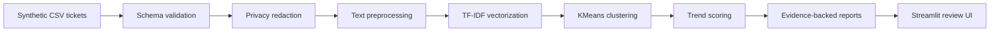

# Architecture

## System Context

AI Support Trend Detection is a local portfolio MVP. It helps a support operations reviewer identify recurring ticket themes, compare current and previous ticket volume, and prepare evidence-backed recommendations for Product and Engineering review.

The current implementation runs locally with a synthetic CSV dataset and does not connect to Zendesk, Jira, Slack, or any production system.

## Input Data

The default input is `data/sample_tickets.csv`. Reviewers may upload another CSV with the same schema from the Streamlit sidebar.

Required fields are documented in `data/README.md`.

## Schema Validation

`src/support_trend_detection/ingestion.py` validates required columns, parses `created_at`, normalizes text fields, and rejects invalid dates or empty ticket IDs.

## Preprocessing And Privacy Handling

`privacy.py` redacts email-like strings, URLs, and account/customer ID patterns from ticket text before analysis. The committed sample data is already synthetic, but this redaction step demonstrates responsible handling for future inputs.

`preprocessing.py` lowercases text, removes punctuation, and combines subject, description, product area, and tags into an analysis text field.

## Representation And Clustering

The current baseline uses:

- `TfidfVectorizer`
- English stop-word removal
- unigram and bigram features
- deterministic `KMeans` clustering

No paid API and no LLM are required.

## Trend Scoring

`trend_scoring.py` compares the current analysis window with the previous window.

Signals include:

- current-period volume
- previous-period volume
- period-over-period growth
- enterprise-tier representation
- affected product areas
- confidence explanation
- suggested priority

## Report Generation

`reporting.py` formats detected trends as JSON and Markdown. The Streamlit app exposes download buttons for both.

## Streamlit Interface

`app.py` provides a reviewer-facing interface:

- load included synthetic data by default
- optionally upload a CSV
- view dataset statistics
- run trend analysis
- review ranked trends
- inspect evidence and recommended actions
- download results

## Local Cache Behavior

The standalone MVP does not commit or require an embeddings cache. If future embedding-based analysis is added, generated cache files should remain ignored by Git.

## Human Review

The tool is designed to support review, not automate operational decisions. Priorities and recommended actions should be checked by a support leader or product partner before action.

## Current Limitations

- Synthetic data only.
- Deterministic baseline clustering, not production ML.
- No live Zendesk, Jira, or Slack integrations.
- No multilingual evaluation.
- No production security or access-control layer.

## Future Architecture Considerations

Future versions could add:

- Zendesk ticket ingestion.
- Jira issue export after human approval.
- Slack notifications for watchlist trends.
- Scheduled analysis.
- LLM-assisted summary drafting.
- Role-based access control and audit logs.

These are future considerations and are not part of the current implementation.
