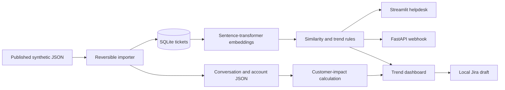

# Architecture

## System Context

AI Support Trend Detection is a local portfolio MVP with three demo surfaces: a Streamlit support workspace, a FastAPI analysis service, and a Zendesk sidebar iframe. They share the same embedding-based detection logic and synthetic runtime data.

```mermaid
flowchart LR
    A[Published synthetic JSON] --> B[Reversible importer]
    B --> C[(SQLite tickets)]
    B --> D[Conversation and account JSON]
    C --> E[Sentence-transformer embeddings]
    E --> F[Similarity and trend rules]
    D --> G[Customer-impact calculation]
    F --> H[Streamlit helpdesk]
    F --> I[FastAPI webhook]
    F --> J[Trend dashboard]
    G --> J
    J --> K[Local Jira draft]
```

## Data Layer

`data/synthetic/full_dataset.json` is the reproducible source. `data/synthetic/import_to_app.py` validates the expected synthetic dataset and builds local files under ignored `data/runtime/`:

- `tickets.db` for searchable ticket metadata;
- `accounts.json` for fictional tier and ARR context;
- `conversations.json` for ticket message threads;
- `embeddings_cache.npz` after the first embedding run.

No generated database or embedding cache is committed.

## Similarity And Trend Rules

`similarity.py` embeds ticket subject and body with `all-MiniLM-L6-v2` and stores normalized vectors. Cosine similarity is therefore a matrix dot product.

For each trigger ticket, candidates must satisfy all of these conditions:

- created in the previous seven days;
- same support category as the trigger;
- semantic similarity of at least 0.60;
- not the trigger ticket itself.

Three or more candidates create a potential-trend warning. `detect_trends_batch` applies the same rules to the ticket queue without recomputing each matrix comparison separately.

## Impact Layer

`impact.py` maps matching tickets to fictional accounts, deduplicates affected accounts, and summarizes customer tier and synthetic ARR at risk. These values demonstrate prioritization context; they are not forecasts.

## Application Surfaces

- `app.py` renders the Zendesk-style queue, ticket conversation, warning, analysis card, investigation dashboard, and Jira-style navigation.
- `trend_view.py` manages the reviewed evidence set, filters, explanations, recalculated impact, and operational timeline.
- `trend_review_store.py` persists confirmed reviews under ignored runtime data so Jira receives the same reviewed cluster after navigation.
- `api/main.py` provides `/analyze`, `/tickets/{ticket_id}`, `/health`, and `/webhooks/tickets/incoming`.
- `zendesk-app/` contains a local ZAF sidebar that calls the API.
- `jira_view.py` reads committed seed issues and stores user-created demo issues in ignored `data/runtime/jira_issues.json`; it does not call Atlassian.

## Failure Boundaries

The app requires imported runtime data. Unknown or stale Jira ticket references are handled without aborting the backlog view. An embedding model download is required on the first run unless it already exists in the local Hugging Face cache.

## Human Review Boundary

Warnings and engineering drafts are recommendations. A reviewer sees similarity evidence, can inspect and exclude source tickets, confirms the reviewed cluster, and remains responsible for escalation and priority decisions.
