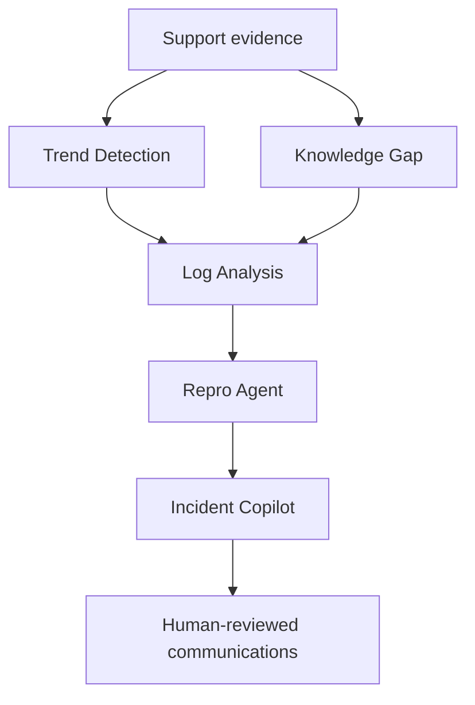

# Future Agent Portfolio

## Overview

AI Support Trend Detection is the first planned module in a portfolio of standalone Support Operations applications. The future agents below are product concepts, not functionality included in this repository. Each will be developed and evaluated independently before any end-to-end orchestration is attempted.

## Trend Detection Agent

**Operational question:** What customer friction is emerging?

**Responsibilities:**

- identify related ticket themes;
- measure changes in contact volume over time;
- surface affected product areas and customer segments;
- collect supporting ticket evidence;
- prepare a human-reviewable Product report.

**Inputs:** support tickets and optional authorized account context.

**Outputs:** ranked trends, growth metrics, evidence IDs, impact framing, confidence, limitations, and recommended next action.

**Status:** portfolio MVP in this repository.

## Knowledge Gap Agent

**Operational question:** Which recurring support contacts indicate missing, ineffective, or hard-to-find guidance?

**Responsibilities:**

- compare recurring ticket themes with available knowledge content;
- identify topics with no relevant article or weak coverage;
- distinguish documentation gaps from product defects;
- prepare an evidence-backed content recommendation;
- measure future changes in ticket volume and content feedback.

**Inputs:** support ticket themes, knowledge-base articles, search queries, and content-performance signals.

**Outputs:** ranked knowledge gaps, supporting ticket examples, matched or missing articles, and a draft content brief.

**Status:** planned standalone repository.

## Log Analysis Agent

**Operational question:** Which technical signals are relevant to the reported customer behavior?

**Responsibilities:**

- parse approved and redacted diagnostic logs;
- identify error signatures and changes in frequency;
- correlate errors with deployments or configuration events;
- cite the exact evidence behind each finding;
- prepare investigation notes without declaring an unverified root cause.

**Inputs:** approved ticket evidence, application logs, deployment events, and environment metadata.

**Outputs:** error patterns, event timeline, evidence references, confidence, and recommended investigation steps.

**Status:** planned standalone repository.

## Repro Agent

**Operational question:** Can the reported behavior be reproduced consistently and communicated clearly to Engineering?

**Responsibilities:**

- organize environment and version details;
- generate structured reproduction steps;
- separate expected and actual behavior;
- identify missing evidence and follow-up questions;
- suggest relevant logs or diagnostics to collect.

**Inputs:** approved ticket evidence, environment details, log findings, and known product behavior.

**Outputs:** reviewable reproduction plan, expected and actual results, prerequisites, evidence gaps, and questions for the customer or support agent.

**Status:** planned standalone repository.

## Incident Copilot

**Operational question:** How should a validated customer-impacting issue be coordinated and communicated?

**Responsibilities:**

- consolidate approved findings from upstream workflows;
- maintain a reviewable incident timeline;
- summarize impact, actions, owners, and open questions;
- draft internal, executive, Slack, and status-page updates;
- preserve human ownership of incident declaration and communication.

**Inputs:** approved trend reports, diagnostic findings, reproduction evidence, incident events, and owner updates.

**Outputs:** situation summary, impact statement, timeline, recommended actions, owner list, and draft stakeholder communications.

**Status:** planned standalone repository.

## How The Modules Connect

This sequence is a target operating model, not a requirement that every case pass through every agent. For example, a documentation question may stop after Knowledge Gap review, while a confirmed product issue may continue through Log Analysis and Repro.

Modules should exchange versioned evidence artifacts containing source references, privacy status, confidence, limitations, and reviewer decisions. They should not depend on undocumented shared state.

## Shared Data Strategy

Public repositories should use synthetic datasets tailored to each workflow:

- support tickets and account tiers for Trend Detection;
- knowledge articles and search signals for Knowledge Gap;
- redacted application and container logs for Log Analysis;
- environment matrices and expected behavior for Repro;
- synthetic timelines and stakeholder updates for Incident Copilot.

Shared identifiers may connect synthetic examples across repositories, but each application must remain runnable and understandable on its own.

## Delivery Standard For Each Repository

Each future project should include:

- a focused business problem and target user;
- a standalone runnable application;
- synthetic example data;
- evidence-backed example outputs;
- automated tests and reproducible setup instructions;
- architecture and limitations documentation;
- privacy and responsible-AI guidance;
- an explicit human-review boundary.

## Portfolio Boundaries

The portfolio will not claim production integrations, automated root-cause determination, autonomous incident declaration, or customer communication unless those capabilities are implemented and evaluated. Future-agent outputs remain recommendations until approved by accountable people.

