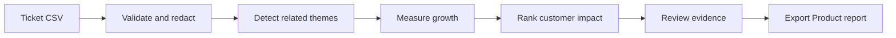
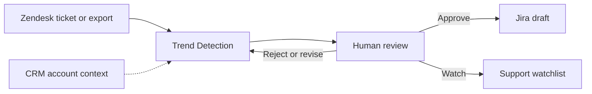

# Product Workflow

## Purpose

AI Support Trend Detection helps Support Operations turn fragmented ticket signals into evidence that Product and Engineering can review. The current portfolio MVP runs as a standalone Streamlit application. Zendesk, CRM, Jira, Slack, and status-page connections described below are planned integration paths, not current production integrations.

## Current MVP Workflow

1. A reviewer loads the included synthetic dataset or uploads a CSV with the documented schema.
2. The application validates required fields, removes duplicate ticket IDs, and redacts obvious PII-like strings.
3. Related tickets are grouped into themes.
4. Current and previous periods are compared to identify emerging patterns.
5. Trends are ranked using volume, growth, customer tier, and ticket priority.
6. The reviewer inspects supporting ticket IDs, impact framing, confidence, and limitations.
7. Approved findings are exported as Markdown or JSON for Product or Engineering review.

The application stops at a reviewable recommendation. It does not automatically create incidents, contact customers, or assign engineering priority.

## Planned Operational Workflow

The planned workflow has three operational surfaces:

| Surface | Purpose | Current status |
|---|---|---|
| Support workspace | Analyze a ticket or scheduled export and show an early trend signal | Planned integration |
| Trend review dashboard | Review cluster growth, customer impact, evidence, and recommended action | Represented by the current Streamlit MVP |
| Engineering workflow | Create a pre-filled Jira draft after human approval | Planned integration |

## Decision States

A detected pattern should move through explicit review states:

| State | Meaning | Expected action |
|---|---|---|
| Watch | Evidence is early or incomplete | Continue monitoring and collect more examples |
| Review | Volume or impact warrants investigation | Assign a Support Operations or Product reviewer |
| Approve | Evidence supports cross-functional action | Prepare a Product or Engineering escalation |
| Revise | The theme is valid but the evidence or framing is incomplete | Correct the report and review again |
| Reject | The pattern is noise, duplicate work, or not actionable | Record the decision and avoid escalation |

## Evidence Package

Each reviewable trend should include:

- trend title and affected product area;
- current and previous ticket volume;
- period-over-period growth;
- affected customer tiers and available account context;
- supporting ticket IDs;
- confidence explanation and known limitations;
- recommended next action;
- reviewer decision and timestamp.

Future CRM enrichment may quantify affected accounts or revenue exposure. Any financial impact must come from authorized source data and remain clearly separated from model-generated interpretation.

## Production Integration Path

The intended production path is incremental:

1. **Offline evaluation:** validate the workflow using synthetic or approved historical exports.
2. **Shadow mode:** analyze fresh exports without creating operational actions.
3. **Human-reviewed pilot:** allow reviewers to approve, revise, or reject recommendations.
4. **Draft integrations:** create Jira drafts or Slack notifications only after approval.
5. **Controlled rollout:** add access controls, audit logs, retention rules, monitoring, and operational ownership.

For an embedded support workflow, a native Zendesk application could call a secured analysis API and open the review dashboard with the relevant evidence ID. This is a future architecture option and is not included in the current repository.

## Success Measures

- time required to identify a review-worthy trend;
- evidence coverage per escalation;
- reviewer acceptance and revision rates;
- false-positive rate;
- time saved compared with manual ticket review;
- percentage of approved reports that lead to a Product or Engineering investigation.

