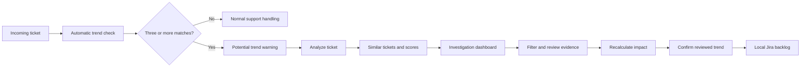

# Product Workflow

## Purpose

The application gives Support Operations an explainable path from one incoming ticket to a reviewable engineering escalation. It stays focused on one standalone agent project and uses local synthetic integrations.

## Implemented Workflow

```mermaid
flowchart LR
    A[Incoming ticket] --> B[Automatic trend check]
    B --> C{Three or more matches?}
    C -->|No| D[Normal support handling]
    C -->|Yes| E[Potential trend warning]
    E --> F[Analyze ticket]
    F --> G[Similar tickets and scores]
    G --> H[Investigation dashboard]
    H --> I[Filter and review evidence]
    I --> J[Recalculate impact]
    J --> K[Confirm reviewed trend]
    K --> L[Local Jira backlog]
```

1. A ticket enters the local support queue or the FastAPI incoming webhook.
2. The system compares it with same-category tickets from the previous seven days.
3. A visible warning appears when at least three tickets meet the 60% similarity threshold.
4. The agent selects **Analyze ticket** to inspect the strongest matches and synthetic customer impact.
5. **Review full trend** opens a filterable table of every qualifying earlier ticket with its score, status, account tier, and match explanation.
6. The reviewer includes or excludes individual tickets. Account counts, tier mix, ARR, evidence, ticket volume, and the engineering draft recalculate immediately.
7. The operational timeline places support-volume events beside clearly labeled synthetic deployment context for correlation review; it does not claim causation.
8. **Confirm trend and update Jira draft** persists the reviewed evidence set across page navigation.
9. **Create or update Jira issue** writes the confirmed draft to the local Jira simulation without creating a duplicate issue for the same trigger ticket.
10. **View Jira backlog** opens the locally simulated engineering queue.

Ordinary tickets remain in the queue without a warning. Boundary cases expose their similarity scores so reviewers can understand why they did or did not cross the threshold. Zendesk supports fast agent triage and escalation; the Dashboard supports cluster-level review across customers and tickets.

## Evidence Package

Each potential trend includes:

- trigger ticket and category;
- time window, threshold, and qualifying match count;
- top similar tickets with scores;
- metadata-based explanations of why each ticket is a plausible match;
- reviewer include/exclude decisions;
- fictional affected accounts, tiers, and ARR;
- ticket-volume and synthetic operational-event timelines;
- sample subjects and ticket IDs;
- a confirmed engineering summary and suggested priority.

## Human Decision Points

The application does not create a real external issue, declare an incident, or contact a customer. A reviewer decides whether each candidate belongs in the cluster, whether the warning represents one product issue, whether the impact framing is credible, and whether the reviewed draft should be escalated.

## Future Production Path

A production pilot would add authenticated ticket ingestion, approved CRM fields, a real Jira draft API, access controls, audit logs, retention rules, monitoring, and reviewer feedback. Those capabilities are outside this repository's current implementation.
