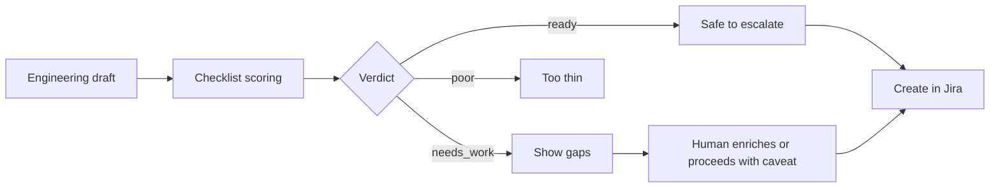

# Escalation Quality Agent

A standalone prototype that scores a support→engineering escalation draft against an explicit checklist before Create in Jira — so Engineering gets a complete handoff, not a thin “something is broken” ticket.

## Why This Matters

Support can detect a real trend and still escalate a weak package: missing expected vs actual, no repro, no customer impact. Engineering then spends the first hours reconstructing context that Support already had. This agent makes those gaps visible *before* the Jira issue is created.

**Project status:** Portfolio MVP — fifth agent in the [AI agents for Support Operations](../README.md) portfolio, linked from Trend Detection before Create in Jira.

> All drafts and ticket IDs in this repository are synthetic. No customer or employer data is included.

## How It Works



1. Take a structured draft (Trend Detection `generate_engineering_ticket` shape, or a richer synthetic package).
2. Run eight weighted checks: title, summary, trigger ticket, evidence count, customer impact, expected vs actual, repro/environment, priority.
3. Compute a 0–100 score and a verdict: **ready** (≥75% and all required checks), **needs_work** (≥50%), or **poor**.
4. List exact gaps and a short recommendation for a human reviewer.
5. In Trend Detection, show the score before Create in Jira as a soft gate — warn, do not auto-block.

## Demo Scenario

1. Run the standalone app (see Quick Start).
2. Open **EQ-GOOD-001** — full handoff with expected/actual, repro, and impact → **Ready**.
3. Open **EQ-LIVE-SHAPE-001** — typical Trend Detection draft → **Needs work** (missing expected/actual and repro).
4. Open **EQ-POOR-001** — thin “Bug / please fix” → **Poor**.
5. In Trend Detection, confirm a trend and open Create in Jira — the same score appears as a review warning.
6. Fill **Expected behavior**, **Actual behavior**, **Reproduction steps**, and **Environment / version** in the Create form, press **Re-check escalation quality** → the live draft moves from **Needs work** to **Ready**, and the same content is written into the created Jira issue.

Scoring only covers escalations that start from a Trend Detection draft; plain Jira issues created outside that flow are not scored in this MVP (see [`docs/limitations.md`](docs/limitations.md)).

## Example Finding

**Draft:** Recurring API key rotation failures (live Trend shape)  
**Verdict:** Needs work — 75% of required fields present, but expected vs actual and repro are missing  
**Evidence:** Trigger `T-20168`, 12 similar tickets, $484K ARR at risk  
**Suggested next step:** Add expected/actual behavior and reproduction steps (or explicitly note them as follow-ups), then create the Jira issue.

## Limitations & Human-in-the-Loop

See [`docs/limitations.md`](docs/limitations.md).

## Quick Start

```bash
cd escalation-quality-agent
pip install -r requirements.txt
streamlit run app.py --server.port 8512
```

Trend Detection linkage uses the same scoring module from the repo root app (`trend_view.py` / Jira create modal) — no extra service.

## Tests

```bash
python -m pytest tests/ -q
```

Tests cover threshold constants, labeled synthetic verdicts, live Trend draft shape, explicit gap-note handling, and the rule that required checks must pass for **ready**.
