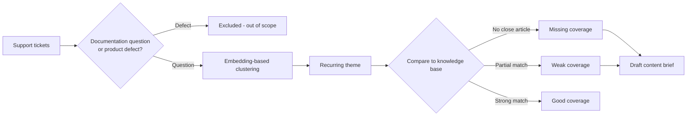

# Knowledge Gap Agent

A standalone prototype that finds recurring support questions your knowledge base doesn't adequately answer, and drafts an evidence-backed content recommendation for a human writer to review.

## Why This Matters

Customers often ask the same question dozens of times before anyone notices the knowledge base has no good answer for it. This prototype clusters recurring support questions, checks them against the existing knowledge base, and ranks the gaps by how many customers are affected, so content teams know exactly what to write next, backed by real evidence instead of guesswork.

**Project status:** Portfolio MVP. Second agent in the [AI agents for Support Operations](../README.md) portfolio, alongside [AI Support Trend Detection](..).

> All tickets and knowledge base articles in this repository are synthetic. No customer or employer data is included.

## How It Works



1. Tickets are filtered to documentation-type questions; bug reports and complaints are excluded, since they are product signals, not documentation gaps.
2. Remaining tickets are embedded (`all-MiniLM-L6-v2`) and greedily clustered into recurring themes by semantic similarity, not keyword matching.
3. Themes with too few tickets are dropped as insufficient evidence.
4. Each theme's centroid is compared against every knowledge base article. The best match's similarity score classifies coverage as **good**, **weak**, or **missing**.
5. Themes are ranked missing-first, then by how many customers were affected.
6. For any theme that isn't well covered, the app drafts a content brief citing the exact evidence tickets.
7. A reviewer can ask local `llama3.2` through Ollama to turn that brief into a full article draft. Generated drafts are saved locally and clearly marked as requiring human review.
8. An approved draft can be published to a **local demo knowledge base page** inside the app, where it can be edited or unpublished. Nothing is sent to a real help center.

## Demo Scenario

1. Run the app (see Quick Start).
2. The dashboard opens already analyzed: missing / weak / good coverage counts up top.
3. **Needs attention this week** lists week-over-week coverage shifts. Each row states the recommended next step and has a matching button (**Create article** for missing, **Improve article** for weak, **View theme** for good) which filters to that coverage and scrolls to the theme.
4. Filter to **Missing** to see recurring questions with no matching article (e.g. "Bulk import users via CSV": 13 customers asked, no article exists).
5. Expand **Draft content brief** to see linked Zendesk evidence, customer quotes, and the proposed article outline.
6. Click **Generate draft** to create a full local draft with Ollama. Review it, regenerate if needed.
7. Click **Publish to knowledge base** to open the demo help-center page, where **Edit** / **Unpublish** are available. Back on the dashboard the button becomes **Update published article**.
8. Mark the theme as addressed when the content work is done.

## Example Finding

**Theme:** Bulk import users via CSV
**Coverage:** Missing. No knowledge base article addresses this at all
**Evidence:** 13 recurring tickets, e.g. `T-30082` "How do I bulk import users via CSV?", `T-30083` "Bulk user import failing silently", `T-30084` "Required CSV format for user import"
**Suggested next step:** Write a new article covering this topic end to end.

Contrast with a **weak** finding, **CSV export**: an article exists ("Data Export Overview") but only mentions PDF/print export, not CSV specifics, so 7 customers still had to ask support directly.

## Limitations & Human-in-the-Loop

See [`docs/limitations.md`](docs/limitations.md) for what this prototype does not do and how the human-review boundary is enforced.

## Shared ticket database

Knowledge Gap tickets live in the **same** `data/runtime/tickets.db` as Trend Detection / Zendesk (`http://localhost:8501`). They use the `T-30xxx` id range and are tagged `knowledge-gap` so this agent can filter them without mixing into unrelated trend analysis.

Evidence ticket links open the real Zendesk detail page. There is no separate mini-Zendesk.

## Quick Start

```bash
# 1. Ensure the shared Trend Detection runtime DB exists
python data/synthetic/import_to_app.py apply

# 2. Generate + merge Knowledge Gap tickets into that DB
cd knowledge-gap-agent
pip install -r requirements.txt
python scripts/generate_dataset.py
python scripts/merge_into_runtime.py

# 3. Run both surfaces
streamlit run app.py --server.port 8511
# in another terminal, from the repo root:
# streamlit run app.py --server.port 8501
```

If port 8511 is already occupied by an old process, use `--server.port 8512`.

The first Knowledge Gap run downloads `all-MiniLM-L6-v2` (if needed) and caches KG ticket/article embeddings to `knowledge-gap-agent/data/embeddings_cache.npz`. Merging clears the shared Trend Detection embedding cache so it rebuilds on next Zendesk start.

Full article generation is optional and local:

```bash
ollama pull llama3.2
```

Ollama must be running at `http://localhost:11434`. Article drafts are stored in the ignored runtime file `knowledge-gap-agent/data/runtime/article_drafts.json`; no ticket evidence is sent to a cloud API. Articles published to the demo knowledge base are stored the same way, in `data/runtime/published_articles.json`.

`.streamlit/config.toml` sets `client.toolbarMode = "viewer"` so Streamlit's developer chrome (and its `C` clear-cache shortcut) stays out of the demo.

## Tests

```bash
python -m pytest tests/ -q
```

Tests cover coverage-threshold classification, exclusion of product-defect tickets, exclusion of low-evidence topics, that the bundled dataset's known missing/good-coverage themes are classified correctly, that theme labels describe the whole cluster rather than one ticket subject, the Ollama prompt contents, and the persistence of drafts, published articles, addressed themes, and weekly coverage changes.
